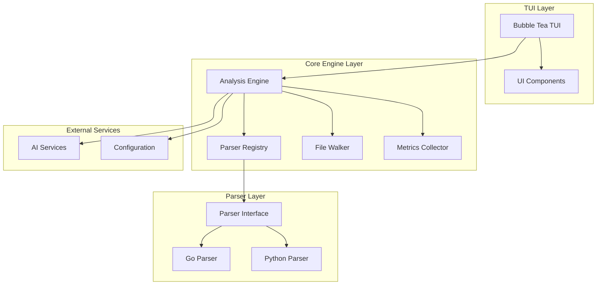
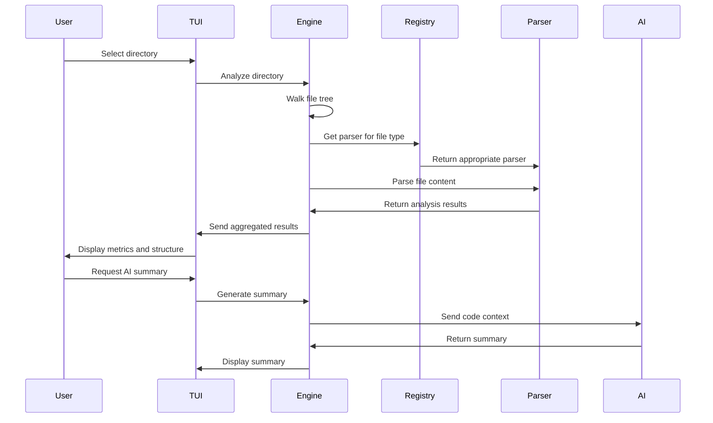

# Design Document

## Overview

CodebaseReader v2 is architected as a modular, concurrent Go application built around a pluggable parser system. The design emphasizes extensibility, performance, and user experience through a clean separation of concerns between the TUI frontend, core analysis engine, and language-specific parsers.

The system follows a layered architecture where the TUI layer handles user interaction, the engine layer orchestrates file processing and analysis, and the parser layer provides language-specific code analysis capabilities. This design enables easy addition of new programming languages without modifying core system components.

## Architecture

### High-Level Architecture Diagram



### Component Interaction Flow



## Components and Interfaces

### Core Parser Interface

The foundation of the extensible architecture is the Parser interface:

```go
type AnalysisResult struct {
    FilePath     string
    Language     string
    LineCount    int
    Functions    []FunctionInfo
    Classes      []ClassInfo
    Imports      []string
    Complexity   int
    Errors       []ParseError
}

type FunctionInfo struct {
    Name       string
    LineStart  int
    LineEnd    int
    Parameters []string
    ReturnType string
    Complexity int
}

type ClassInfo struct {
    Name      string
    LineStart int
    LineEnd   int
    Methods   []FunctionInfo
    Fields    []string
}

type ParseError struct {
    Line    int
    Column  int
    Message string
}

type Parser interface {
    // Parse analyzes file content and returns structured results
    Parse(filePath string, content []byte) (*AnalysisResult, error)
    
    // GetSupportedExtensions returns file extensions this parser handles
    GetSupportedExtensions() []string
    
    // GetLanguageName returns the human-readable language name
    GetLanguageName() string
}
```

### TUI Components

The TUI is built using Bubble Tea and consists of several key components:

```go
type MainModel struct {
    fileTree     filetree.Model
    contentView  contentview.Model
    statusBar    statusbar.Model
    inputField   textinput.Model
    currentView  ViewType
    analysisData *AnalysisData
    loading      bool
}

type ViewType int
const (
    FileTreeView ViewType = iota
    ContentView
    ConfigView
    HelpView
)
```

### Analysis Engine

The core engine orchestrates the analysis process:

```go
type Engine struct {
    parserRegistry *ParserRegistry
    config         *Config
    aiClient       AIClient
    workerPool     *WorkerPool
}

type ParserRegistry struct {
    parsers map[string]Parser
    mutex   sync.RWMutex
}

type WorkerPool struct {
    workers    int
    jobQueue   chan AnalysisJob
    resultChan chan *AnalysisResult
    wg         sync.WaitGroup
}
```

### Configuration System

```go
type Config struct {
    AIProvider    string `json:"ai_provider"`
    APIKey        string `json:"api_key"`
    MaxWorkers    int    `json:"max_workers"`
    OutputFormat  string `json:"output_format"`
    ExcludePatterns []string `json:"exclude_patterns"`
}
```

## Data Models

### Project Analysis Data

```go
type ProjectAnalysis struct {
    RootPath      string
    TotalFiles    int
    TotalLines    int
    Languages     map[string]LanguageStats
    FileResults   []*AnalysisResult
    Summary       string
    GeneratedAt   time.Time
}

type LanguageStats struct {
    FileCount     int
    LineCount     int
    FunctionCount int
    ClassCount    int
    Complexity    int
}
```

### AI Integration Models

```go
type AIRequest struct {
    Provider string
    Model    string
    Prompt   string
    Context  ProjectContext
}

type ProjectContext struct {
    Structure   string
    KeyFiles    []string
    Languages   []string
    Metrics     ProjectAnalysis
}

type AIResponse struct {
    Summary     string
    Insights    []string
    Suggestions []string
    Error       error
}
```

## Error Handling

### Error Types and Handling Strategy

```go
type ErrorType int
const (
    ParseError ErrorType = iota
    FileSystemError
    ConfigurationError
    AIServiceError
    NetworkError
)

type CodebaseError struct {
    Type    ErrorType
    Message string
    File    string
    Line    int
    Cause   error
}

func (e *CodebaseError) Error() string {
    return fmt.Sprintf("[%s] %s", e.Type, e.Message)
}
```

### Error Recovery Patterns

1. **Parser Errors**: Log and continue with other files
2. **File System Errors**: Retry with exponential backoff
3. **AI Service Errors**: Graceful degradation, continue without AI features
4. **Configuration Errors**: Use defaults and warn user

## Testing Strategy

### Unit Testing Approach

```go
// Parser testing interface
type MockParser struct {
    results map[string]*AnalysisResult
    errors  map[string]error
}

func (m *MockParser) Parse(filePath string, content []byte) (*AnalysisResult, error) {
    if err, exists := m.errors[filePath]; exists {
        return nil, err
    }
    return m.results[filePath], nil
}
```

### Integration Testing

1. **TUI Integration Tests**: Test user interactions and state management
2. **Engine Integration Tests**: Test file processing workflows
3. **Parser Integration Tests**: Test with real code samples
4. **AI Integration Tests**: Test with mock AI services

### Performance Testing

1. **Concurrent Processing**: Test with large codebases
2. **Memory Usage**: Monitor memory consumption during analysis
3. **Response Time**: Measure TUI responsiveness

## Performance Considerations

### Concurrency Design

```go
type ConcurrentAnalyzer struct {
    maxWorkers   int
    jobQueue     chan AnalysisJob
    resultQueue  chan *AnalysisResult
    errorQueue   chan error
    done         chan bool
}

func (ca *ConcurrentAnalyzer) ProcessDirectory(rootPath string) <-chan *AnalysisResult {
    // Implementation uses worker pool pattern
    // Limits concurrent file operations
    // Provides backpressure mechanism
}
```

### Memory Management

- Stream processing for large files
- Bounded channels to prevent memory exhaustion
- Garbage collection optimization for long-running analysis

### Caching Strategy

```go
type AnalysisCache struct {
    cache map[string]*CachedResult
    mutex sync.RWMutex
    ttl   time.Duration
}

type CachedResult struct {
    Result    *AnalysisResult
    Timestamp time.Time
    FileHash  string
}
```

## Security Considerations

### Input Validation

- Sanitize file paths to prevent directory traversal
- Validate configuration inputs
- Limit file size for parsing

### API Key Management

- Store API keys securely in configuration
- Support environment variable overrides
- Mask sensitive data in logs

### Network Security

- Use HTTPS for AI service communications
- Implement request timeouts
- Validate SSL certificates

## Deployment and Distribution

### Build Configuration

```go
//go:build release
// +build release

package main

import _ "embed"

//go:embed config/default.json
var defaultConfig []byte
```

### Cross-Platform Considerations

- Use filepath.Join for path operations
- Handle different line endings
- Support various terminal capabilities

### Single Binary Distribution

- Embed default configurations
- Include static assets
- Minimize external dependencies